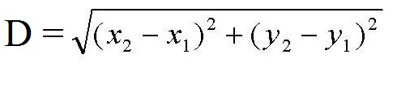

_Exercicio extra: Crie uma funcao que calcula a distancia entre dois pontos e outra para o calculo da colisao. Para saber a distancia entre dois pontos use a funcao sqrt da respectiva linguagem e para a formula use a imagem:_



### Python
```python
from math import sqrt

def distancia(pos_1_x, pos_1_y, pos_2_x, pos_2_y):
  return sqrt (((pos_2_x - pos_1_x) ** 2) + ((pos_2_y - pos_1_y) ** 2))

def has_colision(distancia, raio_1, raio_2):
  if distancia < (raio_1 + raio_2):
    return True
  return False

pos_1_x = int (input ())
pos_1_y = int (input ())
raio_1 = int (input ())

pos_2_x = int (input ())
pos_2_y = int (input ())
raio_2 = int (input ())

print has_colision(distancia(pos_1_x, pos_1_y, pos_2_x, pos_2_y), raio_1, raio_2)
```
