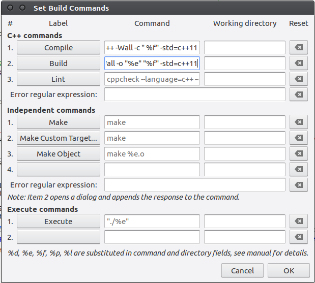
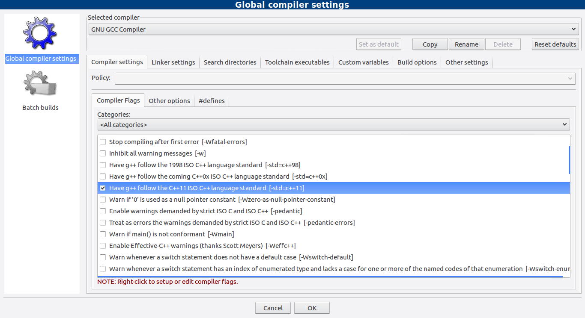
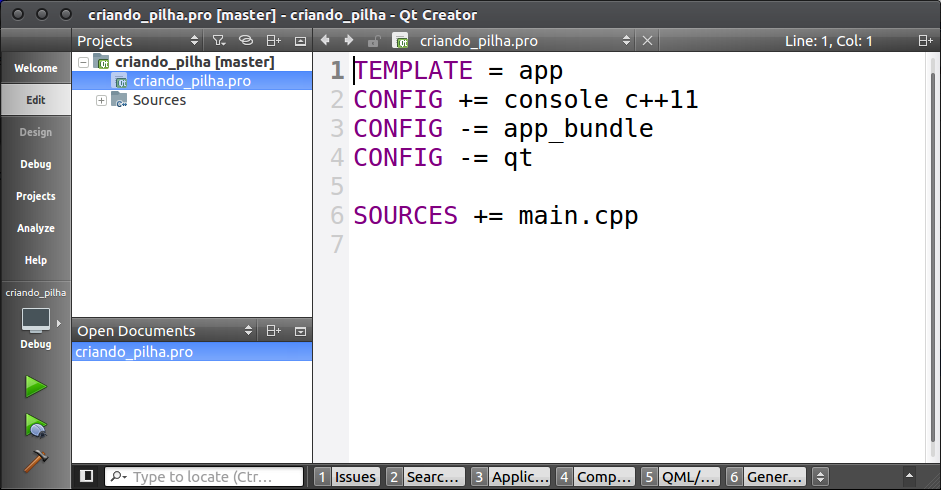

### ufc
# Configurações

## Quais ides utilizar?
Para C e C++ **codeblocks** e o **Geany** são boas opções multiplataforma.

Para python minhas duas preferidas são o **Spyder** e o **Pycharm**.

## E se eu quisar compilar/executar pelo terminal?
Se for compilar/execurar os exercícios no seu computador descubra como adaptar sua IDE para essas versões.
No linux e compilando/executando via linha de comando seria algo mais ou menos assim.

```
gcc -std=c99 prog.c -o prog
g++ -std=c++11 prog.cpp -o prog
python2 prog.py
```

##C++11 e C99
Para configurar o C++11 depende da IDE.

### Geany
**Após abrir um arquivo .cpp** no Geany, vá _Build/Set Build Commands_ e
adicione o texto **-std=c++11** ao final dos comandos de Compile e Build.

Se for usar o c99, abra um arquivo .c e coloque -std=c99.



### Codeblocks
Vá em *Settings/Compiler* e procure a opção para habilitar o c++11. O C99
é default.



### QtCreator
Crie um Projeto/Projeto não Qt/C++ Plano. Abra o arquivo .pro e adicione o
c++11.



