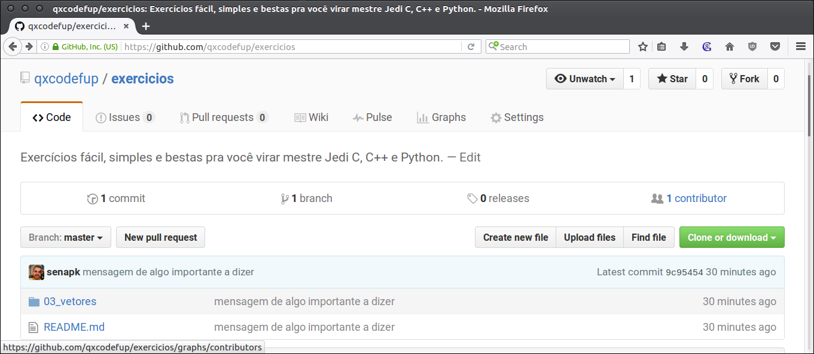
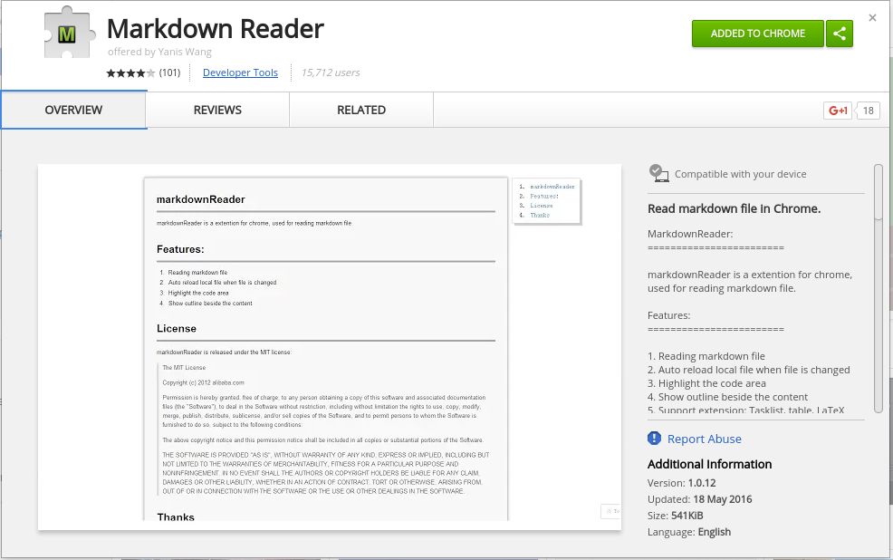
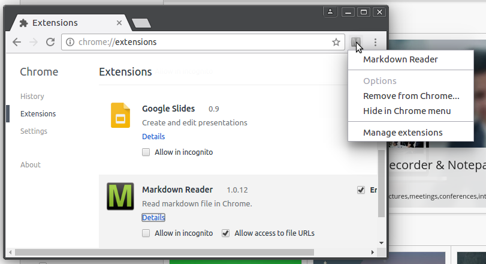

## Baixando o repositório 
Para estudar offline você precisará baixar o repósitório com todos os exercícios.
Vá no [repositório](https://github.com/qxcodefup/exercicios) e clique no botão
Clone ou Download.

Descompacte e você terá todos os arquivos e respostas do projeto. Outra forma é
ir no terminal do linux e digitar:

    git clone https://github.com/qxcodefup/exercicios

Se você não tem o git, poderá instalá-lo pelo Central de Programas da sua
distribuição. No ubuntu e derivados é simples como:
    
    sudo apt-get install git

A vantagem do terminal é que sempre que você quiser atualizar com os novos
exercícios basta entrar na pasta e digitar:

    git pull
    ou
    git pull -f

## Configurando o Google Chrome 

Para visualizar e navegar pelas atividades você vai precisar do Google-Chrome.
Após instalá-lo, instale o plugin Markdown Reader. Procure no Web Store.

Você ainda precisará ir nas configurações de plugins e marcar a opção para 
permitir acesso às URL de arquivo ou o plugin não conseguirá abrir os arquivos
da sua máquina.

Agora é só usar o chrome para abrir o README.md e você poderá navegar pelos
exercícios normalmente. 

Bons exercícios.
